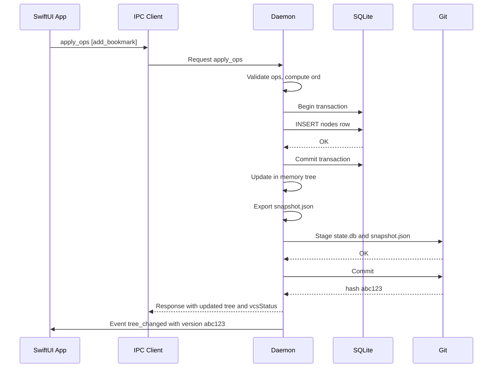
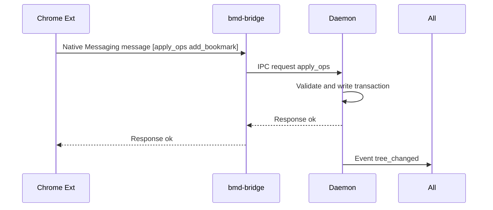
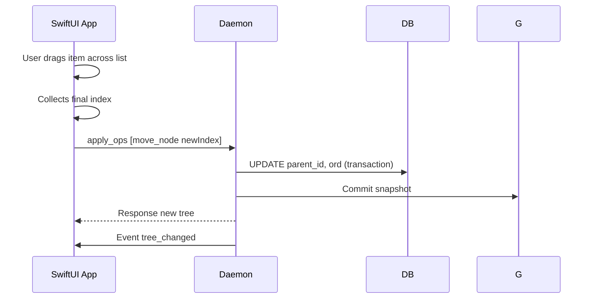
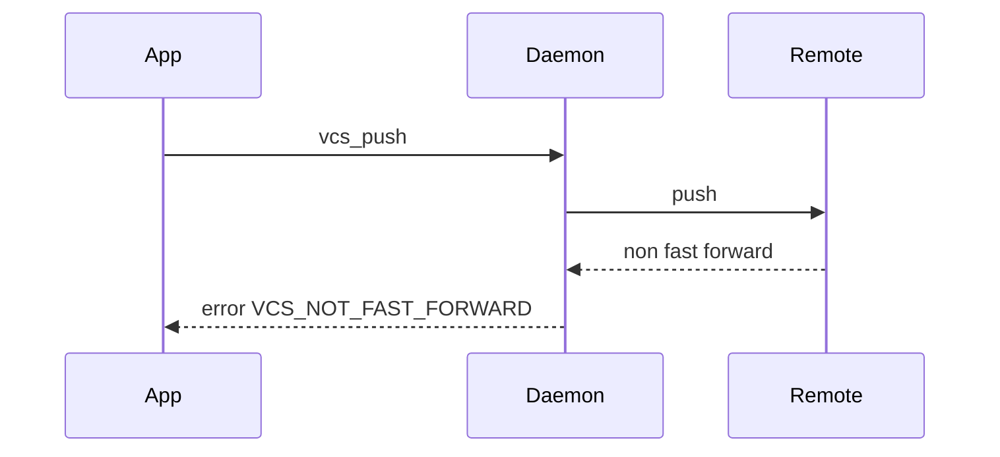

Got it. To remove as many unknowns as possible and let team leads kick off scaffolding immediately, here are five additional, highly executable docs that complement the four you already have. Together they answer the “how do we start today” questions with concrete specs, file templates, and acceptance checks.

Drop these into `docs/` next to the earlier four.

---

## `05-implementation-plan-and-backlog.md`

```markdown
# Implementation Plan and Backlog

Status: ready for execution

## 1. Tracks and owners

- Track A - Core and storage (Go)
- Track B - VCS and snapshot (Go)
- Track C - IPC server and protocol (Go)
- Track D - Daemon process and service integration (Go)
- Track E - Chrome bridge (Go) and MV3 extension (TS)
- Track F - macOS SwiftUI app and Safari extension (Swift)
- Track G - Tooling, CI, packaging, and release

Each track has story cards with acceptance criteria. Stories reference the specs in 01 through 04.

## 2. Milestone 1 - Local core, storage, CLI

A1. Define core types and validation

- Deliverables:
  - `pkg/core` with Node, Tree, Op, validation helpers
  - ULID generator
- Acceptance:
  - Unit tests cover cycle detection, root invariants, url validation

A2. SQLite schema and migrations

- Deliverables:
  - `pkg/storage/sqlite` with schema from spec 03
  - Pragmas configured: foreign_keys on, journal DELETE, sync FULL
  - Migration runner with schemaVersion=1
- Acceptance:
  - `go test ./pkg/storage/...` passes
  - `s0f` can initialize a profile and create `state.db`

A3. Ordering with fractional indexing

- Deliverables:
  - `ord` handling for insert and move
  - Rebalance function for small gaps
- Acceptance:
  - Reordering 1000 siblings preserves order across restarts
  - Rebalance triggers when the gap between siblings drops below the shared `1e-6` epsilon and keeps stable order

A4. CLI for smoke tests

- Deliverables:
  - `cmd/s0f` with `init`, `list`, `add`, `move`, `delete`, `dump-json`
- Acceptance:
  - Manual script creates folders, moves nodes, prints a valid snapshot
  - User-facing subcommands talk to the daemon over IPC (same validations and Git flow as UI); direct storage inspection is limited to explicit `s0f diag`-style commands

## 3. Milestone 2 - Git integration and snapshot

B1. Repo lifecycle

- Deliverables:
  - `pkg/vcs/git` with repo init, stage, commit
- Acceptance:
  - New profile produces `.git`, `state.db`, `snapshot.json`, first commit

B2. Commit on apply

- Deliverables:
  - Core transaction pipeline from 03, with serialized critical section
- Acceptance:
  - After each `s0f add` or `move`, a new commit appears with the auto-derived `apply <n> ops: <first-op-kind>` summary

B3. Optional remote config and fast forward check

- Deliverables:
  - `vcs_push`, `vcs_pull` functions returning VCS_NOT_FAST_FORWARD and VCS_LOCAL_CHANGES_PRESENT
- Acceptance:
  - Push fails if upstream ahead
  - Pull fails if local has unpushed commits, and recovery instructions tell the user to push or reset manually (daemon never auto-stashes)

## 4. Milestone 3 - IPC server

C1. IPC transport

- Deliverables:
  - `pkg/ipc` framing: 4 byte little endian length prefix
  - Unix socket bind with 0700 dir perms
- Acceptance:
  - Test client can send `ping`, receive response

C2. RPC routing and errors

- Deliverables:
  - Request envelope, response envelope with traceId
  - Error codes from 03
- Acceptance:
  - Invalid parent returns VALIDATION_FAILED with details and traceId

C3. Methods

- Deliverables:
  - `get_tree`, `apply_ops`, `search`, `subscribe_events`
- Acceptance:
  - Concurrency: apply ops serialized, reads concurrent
  - Event sent after commit with changedNodeIds

## 5. Milestone 4 - Chrome bridge and extension

E1. Native Messaging host

- Deliverables:
  - `cmd/bmd-bridge` that connects stdin to socket
  - Host manifest with allowed_origins set to extension ID
- Acceptance:
  - Local echo test through bridge passes with sample request

E2. MV3 extension minimal UI

- Deliverables:
  - Button “Add current tab to…” that lists top level folders
- Acceptance:
  - Clicking adds a bookmark and daemon emits event
  - Multi-tab captures are batched into a single `apply_ops` request (e.g., use `save_session`) before they leave the extension or bridge

## 6. Milestone 5 - macOS app and Safari extension

F1. Swift IPC client

- Deliverables:
  - Swift wrapper for socket framing and requests
- Acceptance:
  - `get_tree` and `apply_ops` round trip

F2. SwiftUI tree and DnD

- Deliverables:
  - Sidebar with reorder and move
- Acceptance:
  - Reorder creates a single batch that maps to a single commit

F3. Safari extension (optional for v1)

- Deliverables:
  - “Add current tab” action routed through the app
- Acceptance:
  - Adds to selected folder in daemon

## 7. Milestone 6 - Ops and packaging

G1. Service install

- Deliverables:
  - LaunchAgent plist for dev, systemd unit for Linux, notes for Windows service
- Acceptance:
  - `s0f service install` and `start` work

G2. CI

- Deliverables:
  - GitHub Actions building Go targets and notarized mac app
- Acceptance:
  - Pull request builds produce artifacts

## 8. Cross cutting acceptance

- Snapshot JSON matches schema, includes children arrays in order
- Schema version and migrations pass upgrade from empty to v1
- Logs include traceId on error and info on commit
- Security checks enforce 0700 perms on profile dir, error on wider perms unless override
```

---

## `06-sequence-diagrams.md`

````markdown
# Sequence Diagrams

All messages use framed JSON per IPC spec. Length prefix is 4 byte little endian.

## 1. App adds a bookmark


````

## 2. Chrome extension capture path



## 3. Move with reorder and debounce



## 4. Push fast forward failure



````
---

## `07-repo-scaffold-and-build.md`

```markdown
# Repository Scaffold and Build

## 1. Directory layout
````

. ├─ cmd/ │ ├─ bmd/ # daemon │ ├─ s0f/ # CLI for smoke tests │ └─ bmd-bridge/ # native messaging bridge ├─ pkg/ │ ├─ core/ │ ├─ storage/ │ │ └─ sqlite/ │ ├─ vcs/ │ │ └─ git/ │ ├─ ipc/ │ ├─ config/ │ └─ logging/ ├─ ui/ │ ├─ macos/ │ │ └─ extension/ │ └─ chrome/ ├─ scripts/ │ ├─ dev-profile.sh │ ├─ install-launchagent.sh │ └─ install-native-messaging.sh ├─ docs/ └─ Makefile

```
## 2. Go module files

- Root `go.mod` with Go 1.22 or later
- Lint config with `golangci.yml`

## 3. Make targets
```

make build # build all Go binaries make test # run all Go tests make run-daemon # run bmd against ./_dev_profile make s0f # build CLI make bridge # build native messaging host

```
## 4. CLI usage
```

s0f init --profile ./_dev_profile s0f add --parent root --title "Example" --url "[https://example.com](https://example.com)" s0f list

````
All user-facing `s0f` subcommands communicate with the running daemon over IPC so they share validation, Git commits, and tracing. Only explicit diagnostic verbs (`s0f diag`, `s0f db check`, etc.) should touch SQLite or Git directly, and they must be clearly separated from the UX-oriented verbs.
## 5. LaunchAgent for mac dev

`scripts/install-launchagent.sh` writes `~/Library/LaunchAgents/com.example.bookmarkd.plist` with:

```xml
<?xml version="1.0" encoding="UTF-8"?>
<!DOCTYPE plist PUBLIC "-//Apple//DTD PLIST 1.0//EN"
 "http://www.apple.com/DTDs/PropertyList-1.0.dtd">
<plist version="1.0">
  <dict>
    <key>Label</key><string>com.example.bookmarkd</string>
    <key>ProgramArguments</key>
    <array>
      <string>/usr/local/bin/bmd</string>
      <string>--profile</string>
      <string>/Users/$USER/Library/Application Support/BookmarkRuntime/default</string>
    </array>
    <key>RunAtLoad</key><true/>
    <key>KeepAlive</key><true/>
    <key>EnvironmentVariables</key>
    <dict>
      <key>GODEBUG</key><string>madvdontneed=1</string>
    </dict>
  </dict>
</plist>
````

## 6. systemd user unit for Linux

`~/.config/systemd/user/bookmarkd.service`:

```
[Unit]
Description=Bookmark daemon

[Service]
ExecStart=%h/bin/bmd --profile %h/.local/share/BookmarkRuntime/default
Restart=on-failure

[Install]
WantedBy=default.target
```

## 7. Native Messaging host manifest (Chrome)

`~/Library/Application Support/Google/Chrome/NativeMessagingHosts/com.example.bmd.json`:

```json
{
  "name": "com.example.bmd",
  "description": "Bridge to bookmark daemon",
  "path": "/usr/local/bin/bmd-bridge",
  "type": "stdio",
  "allowed_origins": [
    "chrome-extension://<your-extension-id>/"
  ]
}
```

## 8. Chrome extension scaffolding

- MV3 with `action`, `background service worker`, `side_panel` optional
- Permissions: `"nativeMessaging", "tabs"`
- Use `chrome.runtime.connectNative("com.example.bmd")`

## 9. Swift package setup

- `ui/macos` as an Xcode workspace
- App target, login item helper target for Store build, and Safari App Extension target
- Add a Swift package for the IPC client

````
---

## `08-api-stubs-and-interface-signatures.md`

```markdown
# API Stubs and Interface Signatures

## 1. Go core interfaces

```go
// pkg/core/types.go
type NodeKind string
const (
  KindFolder   NodeKind = "folder"
  KindBookmark NodeKind = "bookmark"
)

type Node struct {
  ID        string
  Kind      NodeKind
  Title     string
  URL       *string
  ParentID  *string
  Ord       float64
  CreatedAt int64
  UpdatedAt int64
}

type Tree struct {
  Version   string
  RootID    string
  Nodes     map[string]Node
  Children  map[string][]string
}

type Op interface{ isOp() }

type AddFolderOp struct { ParentID string; Title string; Index *int }
type AddBookmarkOp struct { ParentID string; Title string; URL string; Index *int }
type RenameNodeOp struct { NodeID string; Title string }
type MoveNodeOp struct { NodeID string; NewParentID string; NewIndex *int }
type DeleteNodeOp struct { NodeID string; Recursive bool }
type UpdateBookmarkOp struct { NodeID string; Title *string; URL *string }
type SaveSessionOp struct { ParentID string; Title string; Tabs []Tab; Index *int }
type Tab struct { Title string; URL string }
````

## 2. Storage contract

```go
// pkg/storage/sqlite/store.go
type Store interface {
  Init(path string) error
  LoadTree(ctx context.Context) (core.Tree, error)
  ApplyOps(ctx context.Context, ops []core.Op) (core.Tree, error)
  WithTx(ctx context.Context, fn func(tx *Tx) error) error
}
```

## 3. VCS contract

```go
// pkg/vcs/git/git.go
type Status struct {
  Committed bool
  Pending   bool
  Pushed    bool
  Hash      string
}

type Repo interface {
  Init(path string) error
  Commit(ctx context.Context, snapshotPath string, dbPath string, message string) (Status, error)
  Push(ctx context.Context) error
  PullFFOnly(ctx context.Context) error
}
```

## 4. IPC request handlers

```go
// pkg/ipc/server.go
type Request struct {
  ID     string          `json:"id,omitempty"`
  Type   string          `json:"type"`
  Params json.RawMessage `json:"params,omitempty"`
}

type Response struct {
  ID      string           `json:"id,omitempty"`
  OK      bool             `json:"ok"`
  Result  json.RawMessage  `json:"result,omitempty"`
  Error   *Error           `json:"error,omitempty"`
  TraceID string           `json:"traceId,omitempty"`
}

type Error struct {
  Code    string                 `json:"code"`
  Message string                 `json:"message"`
  Details map[string]interface{} `json:"details,omitempty"`
}
```

## 5. Swift IPC client shape

```swift
struct RPCRequest<Params: Encodable>: Encodable {
    let id: String
    let type: String
    let params: Params
}

struct RPCResponse<Result: Decodable>: Decodable {
    let id: String?
    let ok: Bool
    let result: Result?
    let error: RPCError?
    let traceId: String?
}

final class IPCClient {
    func connect(socketPath: String) throws {}
    func call<Params: Encodable, Result: Decodable>(
        _ type: String, params: Params, timeout: TimeInterval = 5.0
    ) async throws -> Result {}
    func subscribeEvents() async throws -> AsyncStream<Event> {}
}
```

````
---

## `09-config-schema-and-ops-runbook.md`

```markdown
# Config Schema and Ops Runbook

## 1. Config schema (JSON Schema)

```json
{
  "$schema": "http://json-schema.org/draft-07/schema#",
  "title": "BookmarkRuntimeConfig",
  "type": "object",
  "required": ["profileName", "storage", "vcs", "ipc"],
  "properties": {
    "profileName": {"type": "string"},
    "storage": {
      "type": "object",
      "required": ["dbPath"],
      "properties": {
        "dbPath": {"type": "string"},
        "journalMode": {"type": "string", "enum": ["DELETE"]},
        "synchronous": {"type": "string", "enum": ["FULL"]}
      }
    },
    "vcs": {
      "type": "object",
      "required": ["enabled","branch","autoPush"],
      "properties": {
        "enabled": {"type": "boolean"},
        "branch": {"type": "string"},
        "autoPush": {"type": "boolean"},
        "remote": {
          "type": "object",
          "properties": {
            "url": {"type": "string"},
            "credentialRef": {"type": "string"}
          }
        }
      }
    },
    "ipc": {
      "type": "object",
      "required": ["socketPath"],
      "properties": {
        "socketPath": {"type": "string"},
        "requireToken": {"type": "boolean"},
        "tokenRef": {"type": "string"}
      }
    },
    "logging": {
      "type": "object",
      "properties": {
        "level": {"type": "string", "enum": ["debug","info","warn","error"]},
        "fileMaxSizeMB": {"type": "integer", "minimum": 1},
        "fileMaxBackups": {"type": "integer", "minimum": 1}
      }
    }
  }
}
````

`ipc.requireToken` defaults to `false` so single-user setups stay zero-config, but when operators enable it they must provision `tokenRef` secrets and guarantee every client (CLI, Swift app, extensions) attaches the shared token header before the daemon accepts the connection.

## 2. Ops runbook

### 2.1 First install

- Run `s0f init --profile <dir>`. Confirms 0700 perms or fixes them.
- Starts daemon once for bootstrap, verifies DB and Git repo created.
- Outputs socket path and profile id.

### 2.2 Rotating logs

- Logs roll at N MB and keep M backups based on config.
- `s0f diag` prints last 200 lines and the last 10 commit messages.

### 2.3 Backup and restore

- Backup is simply `git clone` of the repo folder.
- Restore by cloning into a new profile and running `s0f migrate` if schema version differs.

### 2.4 Remote setup

- `s0f remote set <url>` stores url in config and creds in platform secret store.
- `s0f push` uses fast forward only and prints the new upstream hash.
- `s0f pull` is manual; if local commits exist it returns `VCS_LOCAL_CHANGES_PRESENT` until the user pushes or intentionally resets.
- No background sync exists—operators invoke `s0f push/pull` explicitly whenever they want off-box backups.

### 2.5 Incident checklist

- `s0f diag` and attach logs
- Verify socket perms are 0700
- Run `s0f db check` to validate foreign keys and counts
- If Git commit pending, run `s0f vcs retry`

```
---

### Why this set should remove most blockers

- You have a task-by-task plan with acceptance gates
- You have sequence diagrams for the main flows
- You have concrete scaffolding and OS integration files
- You have code-level signatures for teams to build to
- You have a config schema plus an ops playbook

If you want, I can also merge all nine docs into a single `design-book.md`, or generate starter repos with the empty packages and test shells so each lead can begin in their track without waiting on others.
::contentReference[oaicite:0]{index=0}
```
